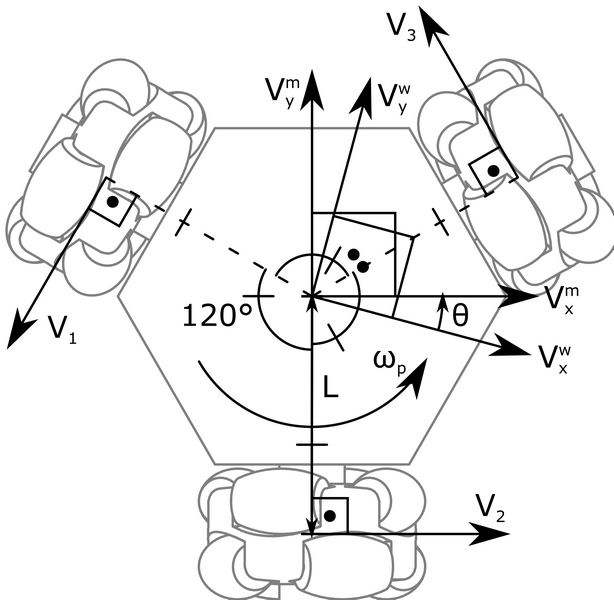

# The ROS packages for IAOCR

<p align="center"> </img></p>
<br>

## Physical addresses
- ip: 10.111.14.11
- username: ubuntu@omnirobot
- password: robotics

## Installation with ROS
__This development is tested on ROS Melodic__

```
$ cd ~/ROS_IAOCR/catkin_ws
$ catkin_make
$ source devel/setup.bash

```

## Launch IAOCR teleop
```
$ roslaunch iaocr_teleop iaocr_teleop.launch 
```

## Background


An omnidirectional mobile platform, with a 3 omnidirectional wheels layout, with two objectives: to facilitate the development of mobile robot control algorithms and to facilitate the development of mobile robots in general by providing a ready to use movement solution.

This is an image I created that should contain all necessary geometric constraints to derive the kinematics equations:



Remember that V1, V2 and V3 are also called, V_left, V_back and V_right, respectively. These are the forward kinematics equations relative to the robot's reference frame:


If you need forward kinematics relative to the world's frame, transform the result of the last equations with the following ones:


For the inverse kinematics, you can start with the velocities relative to the robot's frame, or you can convert the velocities relative to the world's frame with the following equations:


Then, you can use the following equations for the inverse kinematics relative to the robot's frame:


## Notes
- Make sure Gamepad in X mode. Use `left joystick` to control the robot going in desired direction. Use `RB` to rotate to the left, `LB` to rotate to the right
- In the arduino code, running `FORWARD` denotes for clockwise rotation and vice versa

- Object robot in the [Arduino code](./robot_arduino/robot_arduino.ino) contains following functions:
    - `robot.go([left_motor_direction,righ_motor_direction,back_motor_direction],[left_motor_speed,right_motor_speed,back_motor_speed])`, where:
        -` <motor>_direction` = 0 (1) : GO FORWARD (BACKWARD)
        - `<motor>_speed`: 0 - 255
    - `robot.stop()`: stop the robot
    - `robot.turn_right`: rotate the robot clockwise
    - `robot.turn_left`: rotate the robot counter-clockwise
## Resources
- [Rosserial Arduino](http://wiki.ros.org/rosserial_arduino/Tutorials)

## Important command line:
- `$ sudo chmod a+rw /dev/ttyACM0`  # permission for Arduino board to be uploaded
- `$ rosrun rosserial_python serial_node.py /dev/ttyACM0` # intitialize serial communication
